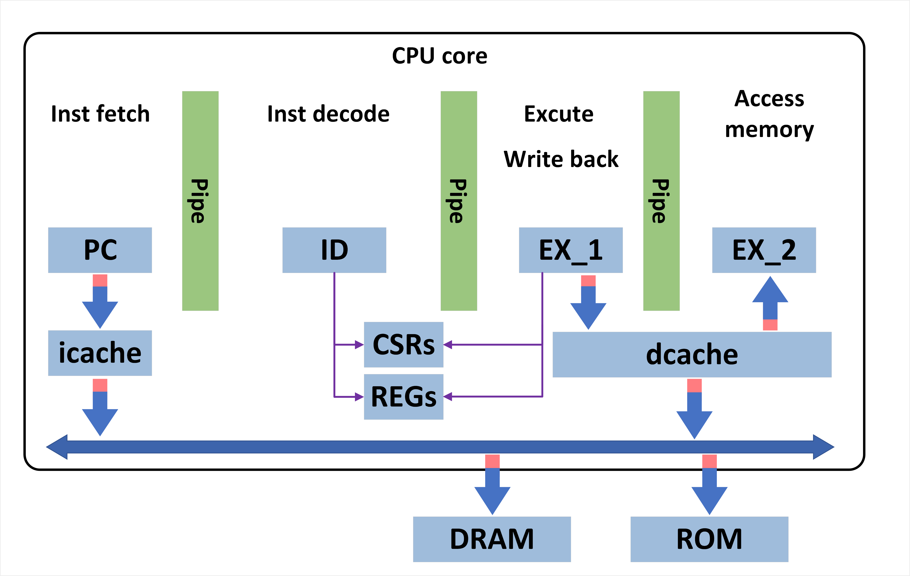

# 项目名称  
五级流水risc-V设计
## 简介  
项目主要参考了三级流水的设计，笔者先拜读了发布在gitee上的代码，并跟着实现了一遍，在实现的过程在也阅读了risc-V的文档。在实现后发现，原项目在 IF，ID，EX的设计比较理想，虽然利用总线来支持IF，EX去访问RAM/ROM，但并没有考虑到cache设计。本项目目标是实现如下结构：

其中针对PC，添加访问icache的接口，重新设计EX模块，增加至五级流水线。
## 特性  
cache：使用LRU策略，4way-4word。
ID：不再通过op_来传递数据。
EX_1:只处理寄存器相关的结果。
EX_2:不一定会工作，可能收到的访问需求是不访问。
EX_3:和EX_2类似，可能不写回。
R
R R R N N
  M M M M M
可能需要考虑，数据一致性问题。
## IF
首先，有一个计数器来记程序当前位置，当正常时，直接去cache取，取出来和地址一起向后传递。当跳转时，暂停三拍流水线，以清空程序计数器。

## 安装  
以下是安装步骤：  
1. 依赖原项目的环境
2. 
3. 

## 使用说明  
在此部分提供使用示例或代码片段。  

```bash  
# 示例代码  
命令或代码